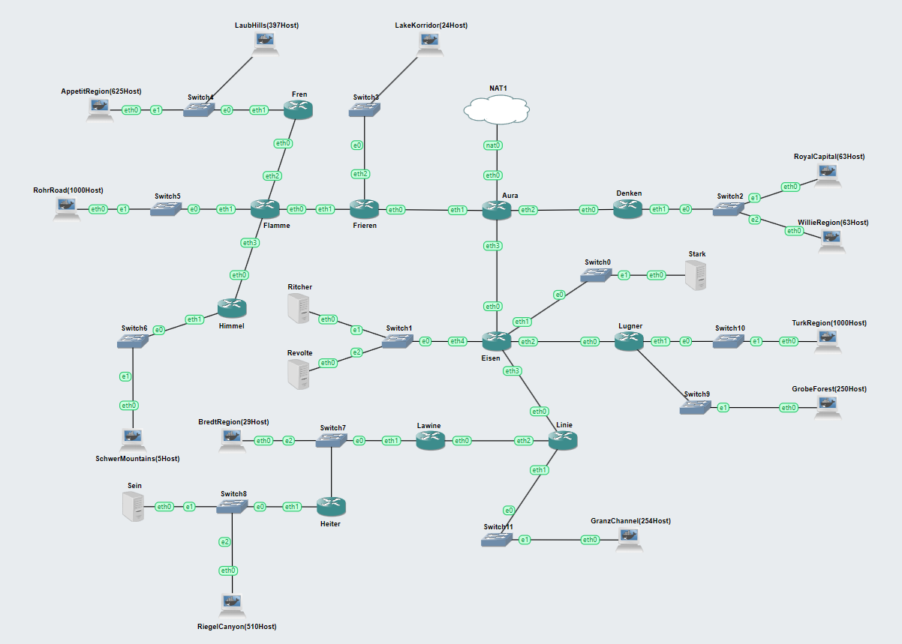

# Jarkom-Modul-4-D22-2-2023

# Anggota

| NRP | Name |
| --- | --- |
| 5025211016 | Thomas Juan Mahardika Suryono |
| 5025211015 | Muhammad Daffa Ashdaqfillah |

# Daftar Isi
- [Subnetting](#subnetting)
- [VLSM CPT](#vlsm-cpt)
  - [Tree](#tree-vlsm)
  - [Pembagian IP](#pembagian-ip-vlsm)
  - [IP Configuration](#ip-configuration-vlsm)
  - [Routing](#routing-vlsm)
  - [Simple PDU Test](#simple-pdu-test)
- [CIDR GNS 3](#cidr-gns-3)
  - [GNS 3 Topologi](#gns-3-topologi)
  - [Flow Pembagian CIDR](#flow-pembagian-cidr)
    - [Pembagian CIDR](#pembagian-cidr)
    - [Tree](#tree)
    - [Pembagian IP](#pembagian-ip)
  - [IP Configuration](#ip-configuration)
  - [Routing](#routing)
  - [Percobaan Ping IP](#percobaan-ping-ip-per-subnet-cidr)
- [Kendala Pengerjaan](#kendala-pengerjaan)

# Subnetting


| Nama Subnet | Rute | Jumlah IP | Netmask |
| --- | --- | --- | --- |
| A1 | Aura-Denken | 2 | /30 |
| A2 | Denken-Switch2-RoyalCapital&WilleRegion | 127 | /24 |
| A3 | Aura-Frieren | 2 | /30 |
| A4 | Frieren-Switch3-LakeKorridor | 25 | /27 |
| A5 | Frieren-Flamme | 2 | /30 |
| A6 | Flamme-Fern | 2 | /30 |
| A7 | Fern-Switch4-AppetitRegion&LaubHills | 1023 | /21 |
| A8 | Flamme-Switch5-RohrRoad | 1001 | /22 |
| A9 | Flamme-Himmel | 2 | /30 |
| A10 | Himmel-Switch6-SchwerMountains | 6 | /29 |
| A11 | Aura-Eisen | 2 | /30 |
| A12 | Eisen-Switch0-Stark | 2 | /30 |
| A13 | Eisen-Switch1-Richter&Revolte | 3 | /29 |
| A14 | Eisen-Lugner | 2 | /30 |
| A15 | Lugner-Switch10-TurkRegion | 1001 | /22 |
| A16 | Lugner-Switch9-GrobeForest | 251 | /24 |
| A17 | Eisen-Linie | 2 | /30 |
| A18 | Linie-Switch11-GranzChannel | 255 | /23 |
| A19 | Linie-Lawine | 2 | /30 |
| A20 | Lawine-Switch7-BredtRegion&Heiter | 31 | /26 |
| A21 | Heiter-Switch8-Sein&RiegelCanyon | 512 | /22 |
| Total |  | 4255 | /19 |

# VLSM CPT

## Tree VLSM


## Pembagian IP VLSM

| Subnet | Network ID | Netmask | Broadcast |
| --- | --- | --- | --- |
| A1 | 192.202.7.104 | 255.255.255.252 | 192.202.7.107 |
| A2 | 192.202.8.0 | 255.255.255.0 | 192.202.8.255 |
| A3 | 192.202.7.108 | 255.255.255.252 | 192.202.7.111 |
| A4 | 192.202.7.160 | 255.255.255.224 | 192.202.7.191 |
| A5 | 192.202.7.112 | 255.255.255.252 | 192.202.7.115 |
| A6 | 192.202.7.116 | 255.255.255.252 | 192.202.7.119 |
| A7 | 192.202.24.0 | 255.255.248.0 | 192.202.31.255 |
| A8 | 192.202.16.0 | 255.255.252.0 | 192.202.19.255 |
| A9 | 192.202.7.120 | 255.255.255.252 | 192.202.7.123 |
| A10 | 192.202.7.144 | 255.255.255.248 | 192.202.7.151 |
| A11 | 192.202.7.124 | 255.255.255.252 | 192.202.7.127 |
| A12 | 192.202.7.128 | 255.255.255.252 | 192.202.7.131 |
| A13 | 192.202.7.152 | 255.255.255.248 | 192.202.7.159 |
| A14 | 192.202.7.132 | 255.255.255.252 | 192.202.7.135 |
| A15 | 192.202.20.0 | 255.255.252.0 | 192.202.23.255 |
| A16 | 192.202.9.0 | 255.255.255.0 | 192.202.9.255 |
| A17 | 192.202.7.136 | 255.255.255.252 | 192.202.7.139 |
| A18 | 192.202.10.0 | 255.255.254.0 | 192.202.11.255 |
| A19 | 192.202.7.140 | 255.255.255.252 | 192.202.7.143 |
| A20 | 192.202.7.192 | 255.255.255.192 | 192.202.7.255 |
| A21 | 192.202.12.0 | 255.255.252.0 | 192.202.15.255 |

## IP Configuration VLSM

### Aura (A1)
```sql
IPv4 Address  : 192.202.7.105
Subnet Mask   : 255.255.255.252
```

### Denken (A1)
```sql
IPv4 Address  : 192.202.7.106
Subnet Mask   : 255.255.255.252
```

### Denken (A2)
```sql
IPv4 Address  : 192.202.8.1
Subnet Mask   : 255.255.255.0
```

### RoyalCapital (A2)
```sql
Default Gateaway  : 192.202.8.1
IPv4 Address      : 192.202.8.2
Subnet Mask       : 255.255.255.0
```

### WilleRegion (A2)
```sql
Default Gateaway  : 192.202.8.1
IPv4 Address      : 192.202.8.65
Subnet Mask       : 255.255.255.0
```

### Aura (A3)
```sql
IPv4 Address  : 192.202.7.109
Subnet Mask   : 255.255.255.252
```

### Frieren (A3)
```sql
IPv4 Address  : 192.202.7.110
Subnet Mask   : 255.255.255.252
```

### Frieren (A4)
```sql
IPv4 Address  : 192.202.7.161
Subnet Mask   : 255.255.255.224
```

### LakeKorridor (A4)
```sql
Default Gateaway  : 192.202.7.161
IPv4 Address      : 192.202.7.162
Subnet Mask       : 255.255.255.224
```

### Frieren (A5)
```sql
IPv4 Address  : 192.202.7.113
Subnet Mask   : 255.255.255.252
```

### Flamme (A5)
```sql
IPv4 Address  : 192.202.7.114
Subnet Mask   : 255.255.255.252
```

### Flame (A6)
```sql
IPv4 Address  : 192.202.7.117
Subnet Mask   : 255.255.255.252
```

### Fern (A6)
```sql
IPv4 Address  : 192.202.7.118
Subnet Mask   : 255.255.255.252
```

### Fern (A7)
```sql
IPv4 Address  : 192.202.24.1
Subnet Mask   : 255.255.248.0
```

### LaubHills (A7)
```sql
Default Gateaway  : 192.202.24.1
IPv4 Address      : 192.202.24.2
Subnet Mask       : 255.255.248.0
```

### AppetitRegion (A7)
```sql
Default Gateaway  : 192.202.24.1
IPv4 Address      : 192.202.25.143
Subnet Mask       : 255.255.248.0
```

### Flamme (A8)
```sql
IPv4 Address  : 192.202.16.1
Subnet Mask   : 255.255.252.0
```

### RohrRoad (A8)
```sql
Default Gateaway  : 192.202.16.1
IPv4 Address      : 192.202.16.2
Subnet Mask       : 255.255.252.0
```

### Flamme (A9)
```sql
IPv4 Address  : 192.202.7.121
Subnet Mask   : 255.255.255.252
```

### Himmel (A9)
```sql
IPv4 Address  : 192.202.7.122
Subnet Mask   : 255.255.255.252
```

### Himmel (A10)
```sql
IPv4 Address  : 192.202.7.145
Subnet Mask   : 255.255.255.248
```

### SchwerMountains (A10)
```sql
Default Gateaway  : 192.202.7.145
IPv4 Address      : 192.202.16.2
Subnet Mask       : 255.255.252.0
```

### Aura (A11)
```sql
IPv4 Address  : 192.202.7.125
Subnet Mask   : 255.255.255.252
```

### Eisen (A11)
```sql
IPv4 Address  : 192.202.7.126
Subnet Mask   : 255.255.255.252
```

### Eisen (A12)
```sql
IPv4 Address  : 192.202.7.129
Subnet Mask   : 255.255.255.252
```

### Stark (A12)
```sql
Default Gateaway  : 192.202.7.129
IPv4 Address      : 192.202.7.130
Subnet Mask       : 255.255.255.252
```

### Eisen (A13)
```sql
IPv4 Address  : 192.202.7.153
Subnet Mask   : 255.255.255.248
```

### Ritcher (A13)
```sql
Default Gateaway  : 192.202.7.153
IPv4 Address      : 192.202.7.154
Subnet Mask       : 255.255.255.248
```

### Revolte (A13)
```sql
Default Gateaway  : 192.202.7.153
IPv4 Address      : 192.202.7.155
Subnet Mask       : 255.255.255.248
```

### Eisen (A14)
```sql
IPv4 Address  : 192.202.7.133
Subnet Mask   : 255.255.255.252
```

### Lugner (A14)
```sql
IPv4 Address  : 192.202.7.134
Subnet Mask   : 255.255.255.252
```

### Lugner (A15)
```sql
IPv4 Address  : 192.202.20.1
Subnet Mask   : 255.255.252.0
```

### TurkRegion (A15)
```sql
Default Gateaway  : 192.202.20.1
IPv4 Address      : 192.202.20.2
Subnet Mask       : 255.255.252.0
```

### Lugner (A16)
```sql
IPv4 Address  : 192.202.9.1
Subnet Mask   : 255.255.255.0
```

### GrobeForest (A16)
```sql
Default Gateaway  : 192.202.9.1
IPv4 Address      : 192.202.9.2
Subnet Mask       : 255.255.255.0
```

### Eisen (A17)
```sql
IPv4 Address  : 192.202.7.137
Subnet Mask   : 255.255.255.252
```

### Linie (A17)
```sql
IPv4 Address  : 192.202.7.138
Subnet Mask   : 255.255.255.252
```

### Linie (A18)
```sql
IPv4 Address  : 192.202.10.1
Subnet Mask   : 255.255.254.0
```

### GranzChannel (A18)
```sql
Default Gateaway  : 192.202.9.1
IPv4 Address      : 192.202.9.2
Subnet Mask       : 255.255.255.0
```

### Linie (A19)
```sql
IPv4 Address  : 192.202.7.141
Subnet Mask   : 255.255.255.252
```

### Lawine (A19)
```sql
IPv4 Address  : 192.202.7.142
Subnet Mask   : 255.255.255.252
```

### Lawine (A20)
```sql
IPv4 Address  : 192.202.7.193
Subnet Mask   : 255.255.255.192
```

### BredtRegion (A20)
```sql
Default Gateaway  : 192.202.7.193
IPv4 Address      : 192.202.7.195
Subnet Mask       : 255.255.255.192
```

### Heiter (A20)
```sql
IPv4 Address  : 192.202.7.194
Subnet Mask   : 255.255.255.192
```

### Heiter (A21)
```sql
IPv4 Address  : 192.202.12.1
Subnet Mask   : 255.255.252.0
```

### Sein (A21)
```sql
Default Gateaway  : 192.202.12.1
IPv4 Address      : 192.202.12.2
Subnet Mask       : 255.255.252.0
```

### RiegelCanyon (A21)
```sql
Default Gateaway  : 192.202.12.1
IPv4 Address      : 192.202.12.3
Subnet Mask       : 255.255.252.0
```

## Routing VLSM

### Aura
```sql
192.202.8.0/24 via 192.202.7.106
192.202.7.160/27 via 192.202.7.110
192.202.7.112/30 via 192.202.7.110
192.202.7.116/30 via 192.202.7.110
192.202.24.0/21 via 192.202.7.110
192.202.16.0/22 via 192.202.7.110
192.202.7.120/30 via 192.202.7.110
192.202.7.152/29 via 192.202.7.126
192.202.7.132/30 via 192.202.7.126
192.202.20.0/22 via 192.202.7.126
192.202.9.0/24 via 192.202.7.126
192.202.7.136/30 via 192.202.7.126
192.202.10.0/23 via 192.202.7.126
192.202.7.140/30 via 192.202.7.126
192.202.7.192/26 via 192.202.7.126
192.202.12.0/22 via 192.202.7.126
192.202.7.104/30 via 192.202.7.106
192.202.7.108/30 via 192.202.7.110
192.202.7.124/30 via 192.202.7.126
```

### Denken
```sql
0.0.0.0/0 via 192.202.7.105
```

### Frieren
```sql
0.0.0.0/0 via 192.202.7.109
192.202.7.116/30 via 192.202.7.114
192.202.24.0/21 via 192.202.7.114
192.202.16.0/22 via 192.202.7.114
192.202.7.120/30 via 192.202.7.114
192.202.7.144/29 via 192.202.7.114
192.202.7.112/30 via 192.202.7.114
```

### Flamme
```sql
0.0.0.0/0 via 192.202.7.113
192.202.24.0/21 via 192.202.7.118
192.202.7.144/29 via 192.202.7.122
192.202.7.116/30 via 192.202.7.118
192.202.7.120/30 via 192.202.7.122
```
### Fern
```sql
0.0.0.0/0 via 192.202.7.117
```

### Himmel
```sql
0.0.0.0/0 via 192.202.7.121
```

### Eisen
```sql
0.0.0.0/0 via 192.202.7.125
192.202.20.0/22 via 192.202.7.134
192.202.9.0/24 via 192.202.7.134
192.202.10.0/23 via 192.202.7.138
192.202.7.140/30 via 192.202.7.138
192.202.7.192/26 via 192.202.7.138
192.202.12.0/22 via 192.202.7.138
192.202.7.132/30 via 192.202.7.134
192.202.7.136/30 via 192.202.7.138
```

### Lugner
```sql
0.0.0.0/0 via 192.202.7.133
```

### Linie
```sql
0.0.0.0/0 via 192.202.7.137
192.202.7.192/26 via 192.202.7.142
192.202.12.0/22 via 192.202.7.142
192.202.7.140/30 via 192.202.7.142
```

### Lawine
```sql
0.0.0.0/0 via 192.202.7.141
192.202.12.0/22 via 192.202.7.194
192.202.7.192/26 via 192.202.7.194
```

### Heiter
```sql
0.0.0.0/0 via 192.202.7.193
```

## Simple PDU Test


# CIDR GNS 3

## GNS 3 Topologi



## Flow Pembagian CIDR


### Pembagian CIDR

| Subnet | Subnet 1 | Netmask 1 | Subnet 2  | Netmask 2 | Netmask Akhir |
| --- | --- | --- | --- | --- | --- |
| B1 | A6 | /30 | A7 | /21 | /20 |
| B2 | A9 | /30 | A10 | /29 | /28 |
| B3 | A21 | /22 | A20 | /26 | /21 |
| B4 | A16 | /24 | A15 | /22 | /21 |
| B5 | A2 | /24 | A1 | /30 | /23 |

| Subnet | Subnet 1 | Netmask 1 | Subnet 2  | Netmask 2 | Netmask Akhir |
| --- | --- | --- | --- | --- | --- |
| C1 | B2 | /28 | A8 | /22 | /21 |
| C2 | B3 | /21 | A19 | /30 | /20 |
| C3 | B4 | /21 | A14 | /30 | /20 |

| Subnet | Subnet 1 | Netmask 1 | Subnet 2  | Netmask 2 | Netmask Akhir |
| --- | --- | --- | --- | --- | --- |
| D1 | C1 | /21 | B1 | /20 | /19 |
| D2 | C2 | /20 | A18 | /23 | /19 |
| D3 | C3 | /20 | A12 | /30 | /19 |

| Subnet | Subnet 1 | Netmask 1 | Subnet 2  | Netmask 2 | Netmask Akhir |
| --- | --- | --- | --- | --- | --- |
| E1 | D1 | /19 | A5 | /30 | /18 |
| E2 | D2 | /19 | A17 | /30 | /18 |
| E3 | D3 | /19 | A13 | /29 | /18 |

| Subnet | Subnet 1 | Netmask 1 | Subnet 2  | Netmask 2 | Netmask Akhir |
| --- | --- | --- | --- | --- | --- |
| F1 | E1 | /18 | A5 | /27 | /17 |
| F2 | E2 | /18 | E3 | /18 | /17 |

| Subnet | Subnet 1 | Netmask 1 | Subnet 2  | Netmask 2 | Netmask Akhir |
| --- | --- | --- | --- | --- | --- |
| G1 | F1 | /17 | A3 | /30 | /16 |
| G2 | F2 | /17 | A11 | /30 | /16 |

| Subnet | Subnet 1 | Netmask 1 | Subnet 2  | Netmask 2 | Netmask Akhir |
| --- | --- | --- | --- | --- | --- |
| H1 | G1 | /16 | G2 | /16 | /15 |

| Subnet | Subnet 1 | Netmask 1 | Subnet 2  | Netmask 2 | Netmask Akhir |
| --- | --- | --- | --- | --- | --- |
| I1 | H1 | /15 | B5 | /23 | /14 |

## Tree


### Pembagian IP

| Subnet | Network ID | Netmask | Broadcast |
| --- | --- | --- | --- |
| A1 | 198.204.1.0 | 255.255.255.252 | 198.204.1.3  |
| A2 | 198.204.0.0 | 255.255.255.0 | 198.204.0.255 |
| A3 | 198.202.128.0 | 255.255.255.252 | 198.202.128.3  |
| A4 | 198.202.64.0 | 255.255.255.252 | 198.202.64.3  |
| A5 | 198.202.32.0 | 255.255.255.252 | 198.202.32.3  |
| A6 | 198.202.24.0 | 255.255.255.252 | 198.202.24.3 |
| A7 | 198.202.16.0 | 255.255.248.0 | 198.202.23.255 |
| A8 | 198.202.4.0 | 255.255.252.0 | 198.202.7.255 |
| A9 | 198.202.0.8 | 255.255.255.252 | 198.202.0.11  |
| A10 | 198.202.0.0 | 255.255.255.248 | 198.202.0.7 |
| A11 | 198.203.128.0 | 255.255.255.252 | 198.203.128.3 |
| A12 | 198.203.80.0 | 255.255.255.252 | 198.203.80.3 |
| A13 | 198.203.96.0 | 255.255.255.252 | 198.203.96.3 |
| A14 | 198.203.72.0 | 255.255.255.252 | 198.203.72.3 |
| A15 | 198.203.64.0 | 255.255.252.0 | 198.203.67.255 |
| A16 | 198.203.68.0 | 255.255.255.0 | 198.203.68.255 |
| A17 | 198.203.32.0 | 255.255.255.252 | 198.203.32.3 |
| A18 | 198.203.16.0 | 255.255.254.0 | 198.203.17.255 |
| A19 | 198.203.8.0 | 255.255.255.252 | 198.203.8.3 |
| A20 | 198.203.4.0 | 255.255.255.192 | 198.203.4.63 |
| A21 | 198.203.0.0 | 255.255.252.0 | 198.203.3.255 |

## IP Configuration

### Aura (A1-A3-A11)

```sql
auto lo
iface lo inet loopback

auto eth0
iface eth0 inet dhcp

auto eth1
iface eth1 inet static
address 198.202.128.1
netmask 255.255.255.252

auto eth2
iface eth2 inet static
address 198.204.1.1
netmask 255.255.255.252

auto eth3
iface eth3 inet static
address 198.203.128.1
netmask 255.255.255.252
```

### Denken (A1-A2)

```sql
auto lo
iface lo inet loopback

auto eth0
iface eth0 inet static
address 198.204.1.2
netmask 255.255.255.252
gateway 198.204.1.1

auto eth1
iface eth1 inet static
address 198.204.0.1
netmask 255.255.255.0
```

### RoyalCapital (A2)

```sql
auto eth0
iface eth0 inet static
address 198.204.0.2
netmask 255.255.255.0
gateway 198.204.0.1
```

### WillieRegion (A2)

```sql
auto eth0
iface eth0 inet static
address 198.204.0.3
netmask 255.255.255.0
gateway 198.204.0.1
```

### Frieren (A4-A5)

```sql
auto lo
iface lo inet loopback

auto eth0
iface eth0 inet static
address 198.202.128.2
netmask 255.255.255.252
gateway 198.202.128.1

auto eth1
iface eth1 inet static
address 198.202.32.1
netmask 255.255.255.252

auto eth2
iface eth2 inet static
address 198.202.64.1
netmask 255.255.255.252
```

### LakeKorridor (A4)

```sql
auto eth0
iface eth0 inet static
address 198.202.64.2
netmask 255.255.255.252
gateway 198.202.64.1
```

### Flamme (A5-A6-A8-A9)

```sql
auto lo
iface lo inet loopback

auto eth0
iface eth0 inet static
address 198.202.32.2
netmask 255.255.255.252
gateway 198.202.32.1

auto eth1
iface eth1 inet static
address 198.202.4.1
netmask 255.255.252.0

auto eth2
iface eth2 inet static
address 198.202.24.1
netmask 255.255.255.252

auto eth3
iface eth3 inet static
address 198.202.0.9
netmask 255.255.255.252
```

### Fren (A6)

```sql
auto lo
iface lo inet loopback

auto eth0
iface eth0 inet static
address 198.202.24.2
netmask 255.255.255.252
gateway 198.202.24.1

auto eth1
iface eth1 inet static
address 198.202.16.1
netmask 255.255.248.0
```

### AppetitRegion (A7)

```sql
auto eth0
iface eth0 inet static
address 198.202.16.2
netmask 255.255.248.0
gateway 198.202.16.1
```

### LaubHills (A7)

```sql
auto eth0
iface eth0 inet static
address 198.202.16.3
netmask 255.255.248.0
gateway 198.202.16.1
```

### RohrRoad (A8)

```sql
auto eth0
iface eth0 inet static
address 198.202.4.2
netmask 255.255.252.0
gateway 198.202.4.1
```

### Himmel (A9-A10)

```sql
auto lo
iface lo inet loopback

auto eth0
iface eth0 inet static
address 198.202.0.10
netmask 255.255.255.252
gateway 198.202.0.9

auto eth1
iface eth1 inet static
address 198.202.0.1
netmask 255.255.255.248
```

### SchwerMountains (A10)

```sql
auto eth0
iface eth0 inet static
address 198.202.0.2
netmask 255.255.255.248
gateway 198.202.0.1
```

### Eisen (A11-A12-A13-A14)

```sql
auto lo
iface lo inet loopback

auto eth0
iface eth0 inet static
address 198.203.128.2
netmask 255.255.255.252
gateway 198.203.128.1

auto eth1
iface eth1 inet static
address 198.203.80.1
netmask 255.255.255.252

auto eth2
iface eth2 inet static
address 198.203.72.1
netmask 255.255.255.252

auto eth3
iface eth3 inet static
address 198.203.32.1
netmask 255.255.255.252

auto eth4
iface eth4 inet static
address 198.203.96.1
netmask 255.255.255.252
```

### Stark (A12)

```sql
auto eth0
iface eth0 inet static
address 198.203.80.2
netmask 255.255.255.252
gateway 198.203.80.1
```

### Ritcher (A13)

```sql
auto eth0
iface eth0 inet static
address 198.203.96.2
netmask 255.255.255.252
gateway 198.203.96.1
```

### Revolte (A13)

```sql
auto eth0
iface eth0 inet static
address 198.203.96.3
netmask 255.255.255.252
gateway 198.203.96.1
```

### Lugner (A14)

```sql
auto lo
iface lo inet loopback

auto eth0
iface eth0 inet static
address 198.203.72.2
netmask 255.255.255.252
gateway 198.203.72.1

auto eth1
iface eth1 inet static
address 198.203.64.1
netmask 255.255.252.0

auto eth2
iface eth2 inet static
address 198.203.68.1
netmask 255.255.255.0
```

### TurkRegion (A15)

```sql
auto eth0
iface eth0 inet static
address 198.203.64.2
netmask 255.255.252.0
gateway 198.203.64.1
```

### GrobeForest (A16)

```sql
auto eth0
iface eth0 inet static
address 198.203.68.2
netmask 255.255.255.0
gateway 198.203.68.1
```

### Linie (A17-A18-A19)

```sql
auto lo
iface lo inet loopback

auto eth0
iface eth0 inet static
address 198.203.32.2
netmask 255.255.255.252
gateway 198.203.32.1

auto eth1
iface eth1 inet static
address 198.203.16.1
netmask 255.255.254.0

auto eth2
iface eth2 inet static
address 198.203.8.1
netmask 255.255.255.252
```

### GranzChannel (A18)

```sql
auto eth0
iface eth0 inet static
address 198.203.16.2
netmask 255.255.254.0
gateway 198.203.16.1
```

### Lawine (A19-A20)

```sql
auto lo
iface lo inet loopback

auto eth0
iface eth0 inet static
address 198.203.8.2
netmask 255.255.255.252
gateway 198.203.8.1

auto eth1
iface eth1 inet static
address 198.203.4.1
netmask 255.255.255.192
```

### BredtRegion (A20)

```sql
auto eth0
iface eth0 inet static
address 198.203.4.2
netmask 255.255.255.192
gateway 198.203.4.1
```

### Heiter (A20-A21)

```sql
auto lo
iface lo inet loopback

auto eth0
iface eth0 inet static
address 198.203.4.3
netmask 255.255.255.192
gateway 198.203.4.1

auto eth1
iface eth1 inet static
address 198.203.0.1
netmask 255.255.252.0
```

### Sein (A21)

```sql
auto eth0
iface eth0 inet static
address 198.203.0.2
netmask 255.255.252.0
gateway 198.203.0.1
```

### RiegelCanyon (A21)

```sql
auto eth0
iface eth0 inet static
address 198.203.0.3
netmask 255.255.252.0
gateway 198.203.0.1
```

## Routing

### Fren

```sql
echo nameserver 192.168.122.1 > /etc/resolv.conf
route add -net 0.0.0.0 netmask 0.0.0.0 gw 198.202.24.1
```

### Himmel

```sql
echo nameserver 192.168.122.1 > /etc/resolv.conf
route add -net 0.0.0.0 netmask 0.0.0.0 gw 198.202.0.9
```

### Flamme

```sql
echo nameserver 192.168.122.1 > /etc/resolv.conf
route add -net 0.0.0.0 netmask 0.0.0.0 gw 198.202.32.1

# A9
route add -net 198.202.0.8 netmask 255.255.255.252 gw 198.202.0.10
# A10
route add -net 198.202.0.0 netmask 255.255.255.248 gw 198.202.0.10
# A6
route add -net 198.202.24.0 netmask 255.255.255.252 gw 198.202.24.2
# A7
route add -net 198.202.16.0 netmask 255.255.248.0 gw 198.202.24.2
```

### Frieren

```sql
echo nameserver 192.168.122.1 > /etc/resolv.conf
route add -net 0.0.0.0 netmask 0.0.0.0 gw 198.202.128.1

# A5
route add -net 198.202.32.0 netmask 255.255.255.252 gw 198.202.32.2
# A8
route add -net 198.202.4.0 netmask 255.255.252.0 gw 198.202.32.2
# A9
route add -net 198.202.0.8 netmask 255.255.255.252 gw 198.202.32.2
# A10
route add -net 198.202.0.0 netmask 255.255.255.248 gw 198.202.32.2
# A6
route add -net 198.202.24.0 netmask 255.255.255.252 gw 198.202.32.2
# A7
route add -net 198.202.16.0 netmask 255.255.248.0 gw 198.202.32.2
```

### Heiter

```sql
echo nameserver 192.168.122.1 > /etc/resolv.conf
route add -net 0.0.0.0 netmask 0.0.0.0 gw 198.203.4.1
```

### Lawine

```sql
echo nameserver 192.168.122.1 > /etc/resolv.conf
route add -net 0.0.0.0 netmask 0.0.0.0 gw 198.203.8.1

# A20
route add -net 198.203.4.0 netmask 255.255.255.192 gw 198.203.4.3
# A21
route add -net 198.203.0.0 netmask 255.255.252.0 gw 198.203.4.3
```

### Linie

```sql
echo nameserver 192.168.122.1 > /etc/resolv.conf
route add -net 0.0.0.0 netmask 0.0.0.0 gw 198.203.32.1

# A19
route add -net 198.203.8.0 netmask 255.255.255.252 gw 198.203.8.2
# A20
route add -net 198.203.4.0 netmask 255.255.255.192 gw 198.203.8.2
# A21
route add -net 198.203.0.0 netmask 255.255.252.0 gw 198.203.8.2
```

### Lugner

```sql
echo nameserver 192.168.122.1 > /etc/resolv.conf
route add -net 0.0.0.0 netmask 0.0.0.0 gw 198.203.72.1
```

### Denken

```sql
echo nameserver 192.168.122.1 > /etc/resolv.conf
route add -net 0.0.0.0 netmask 0.0.0.0 gw 198.204.1.1
```

### Eisen

```sql
echo nameserver 192.168.122.1 > /etc/resolv.conf
route add -net 0.0.0.0 netmask 0.0.0.0 gw 198.203.128.1

# A14
route add -net 198.203.72.0 netmask 255.255.255.252 gw 198.203.72.2
# A15
route add -net 198.203.64.0 netmask 255.255.252.0 gw 198.203.72.2
# A16
route add -net 198.203.68.0 netmask 255.255.255.0 gw 198.203.72.2
# A17
route add -net 198.203.32.0 netmask 255.255.255.252 gw 198.203.32.2
# A18
route add -net 198.203.16.0 netmask 255.255.254.0 gw 198.203.32.2
# A19
route add -net 198.203.8.0 netmask 255.255.255.252 gw 198.203.32.2
# A20
route add -net 198.203.4.0 netmask 255.255.255.192 gw 198.203.32.2
# A21
route add -net 198.203.0.0 netmask 255.255.252.0 gw 198.203.32.2
```

### Aura

```sql
iptables -t nat -A POSTROUTING -o eth0 -j MASQUERADE -s 192.202.0.0/14

# A1
route add -net 198.204.1.0 netmask 255.255.255.252 gw 198.204.1.2
# A2
route add -net 198.204.0.0 netmask 255.255.255.0 gw 198.204.1.2
# A3
route add -net 198.202.128.0 netmask 255.255.255.252 gw 198.202.128.2
# A4
route add -net 198.202.64.0 netmask 255.255.255.252 gw 198.202.128.2
# A5
route add -net 198.202.32.0 netmask 255.255.255.252 gw 198.202.128.2
# A6
route add -net 198.202.24.0 netmask 255.255.255.252 gw 198.202.128.2
# A7
route add -net 198.202.16.0 netmask 255.255.248.0 gw 198.202.128.2
# A8
route add -net 198.202.4.0 netmask 255.255.252.0 gw 198.202.128.2
# A9
route add -net 198.202.0.8 netmask 255.255.255.252 gw 198.202.128.2
# A10
route add -net 198.202.0.0 netmask 255.255.255.248 gw 198.202.128.2
# A11
route add -net 198.203.128.0 netmask 255.255.255.252 gw 198.203.128.2
# A12
route add -net 198.203.80.0 netmask 255.255.255.252 gw 198.203.128.2
# A13
route add -net 198.203.96.0 netmask 255.255.255.252 gw 198.203.128.2
# A14
route add -net 198.203.72.0 netmask 255.255.255.252 gw 198.203.128.2
# A15
route add -net 198.203.64.0 netmask 255.255.252.0 gw 198.203.128.2
# A16
route add -net 198.203.68.0 netmask 255.255.255.0 gw 198.203.128.2
# A17
route add -net 198.203.32.0 netmask 255.255.255.252 gw 198.203.128.2
# A18
route add -net 198.203.16.0 netmask 255.255.254.0 gw 198.203.128.2
# A19
route add -net 198.203.8.0 netmask 255.255.255.252 gw 198.203.128.2
# A20
route add -net 198.203.4.0 netmask 255.255.255.192 gw 198.203.128.2
# A21
route add -net 198.203.0.0 netmask 255.255.252.0 gw 198.203.128.2
```

### Tambahkan setiap konfigurasi pada /root/.bashrc

```sql
nano /root/.bashrc
```

## Percobaan Ping IP (per Subnet CIDR)

### A2 (RoyalCapital - WilleRegion)

```sql
ping 198.204.0.3 -c 3
```


### B1 (LaubHills - AppetitRegion)

```sql
ping 198.202.16.2 -c 3
```


### C1 (RohrRoad - SchewerMountains)

```sql
ping 198.202.0.2 -c 3
```


### D2 (RiegelCanyon - GranzChannel)

```sql
ping 198.203.16.2 -c 3
```


### E1 (RohrRoad - Frieren)

```sql
ping 198.202.128.2 -c 3
```


### F1 (RohrRoad - LakeKorridor)

```sql
ping 198.202.64.2 -c 3
```


### G1 (RohrRoad - Frieren)

```sql
ping 198.202.128.2 -c 3
```


### H1 (RohrRoad - GanzChannel)

```sql
ping 198.203.16.2 -c 3
```


### I1 (RohrRoad - RoyalCapital)

```sql
ping 198.204.0.2 -c 3
```


## Kendala Pengerjaan
